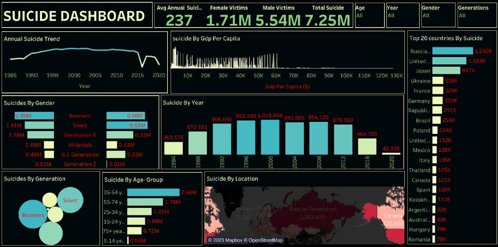

### Global-Suicide-Analysis

## Introduction

Suicide is a global societal phenomenon. My quest to study and look into rising suicide rate in the world compare to previous years led me to this analysis. It's conventional knowledge that suicide rate presently in the world is on the increase again. though it's beyond the scope of this analysis to give reasons for this rising phenomenon. However, very few African countries data were available at the time of this analysis. African countries are highly superstitious, it's a belief that such issues should be swept under the carpet, as a secret and in most cases, the cause of the victim's sickness is changed to sickness instead of suicide. Therefore, obtaining Africans suicide data is very challenging , so most countries involved in this analysis are European, Asian and American countries. It's very important to state that this analysis covers a period of 1985-2022, a period of 35years. 

## Problem Statement

The objectives of this analysis is to analysis:

1. The total suicide rate between 1985-2022.

2. Gender wise suicide victims.

3. Suicide rate by different age group.

4. Suicide rate among the five different generations represented.

5. Suicide rate trendline.

6. Top 20 countries by suicide.

7. Suicide and GDP per capita.

## Skill Demonstrated

This is Tableau based analysis. Tableau superior inbuilt data manipulation tools helps in gaining powerful insights into the analysis. The following tableau  features were incorporated:
- measures creation using calculated field
- Parameters created using calculated filed
- slicers
- filters

People often hide from using tableau because some charts will have to be generated or manipulated to create them, this is actually the beauty of tableau not to talk of creating calculated field for slicers and parameters. 

## Data Sourcing

The source of this data is from www.kaggle.com. It's a large CSV file having almost 32 thousand rows and 12 columns. 

## Data Transformation 

Surprisingly, this is a clean data with few very null values, which was filtered out. 

## Data Modelling
This is a single file data, hence no data modelling was needed.

## Analysis And visualization 

[Click here for the interactive suidicide dashboard](https://public.tableau.com/app/profile/joseph.adedayo/viz/SuicideAnalyticalDashboard/Dashboard1)

1. Total suicides between the period is approximately 7.25M.

2. Suicide rate is higher among male than female , this is over 76% of the total suicides recorded.

3. The boomers and the Silent generation had the highest rates of suicides, partly due to the effect of the world war and post world war

4. Suicide rate is also higher among the age group of 35-54years. Probably due to being the height of dependent population, increased expectations and responsibilities.

5. Suicide rate was at highest in 2000s and at all time lowest in 2015 and has been falling since then 

6. There is a trend with GDP per capita, it was higher when per capita income was lower and has been failing as per capita income increases

7. Russia, United State and Japan are top three countries with the highest rate of suicide within the period in consideration.

8. An average of 237 people commit suicide globally annually based on the data available , should be more if African data are added into this analysis

9. European countries have higher suicide rate than other continents.

10. Generally, rate of suicide has been falling compare to previous decades. Probably due to awareness and deliberate effort of government to combat mental health on the increase.

## Recommendations and conclusions 

1. Mental health should be taken seriously , most suicide victims have history of depression.

2. Strange behaviour like isolation and withdrawal symptoms should be taken as signs of suicide if not handle with care , such person should be placed under proper monitoring and surveillance by families and friends.

3. People who have had failed suicide attempts should be placed in the rehabilitation homes , safe from injuries and hurt, professional therapists should be involved also in the process of healing people with depression.

3. Government of African countries should follow their European and western counterparts by building rehabilitation centres for people who are emotionally unstable, depressed and having early signs of depression and mental health. 

4. Globally, the the world economy is on a down turn, this makes cost of living very high, thereby leading to low standard of living, anxiety and depression. 

